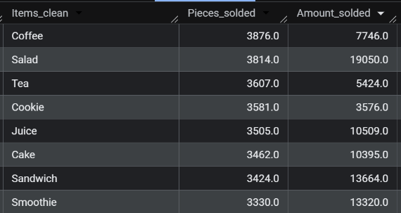

# CAFE SALES
| Analysis exercise from a Kaggle dataset: /kaggle/input/cafe-sales-dirty-data-for-cleaning-training 

Table of the sales 2023 of a café, this analysis will serve to evaluate which products sell the most in what months, with the goal of making more of them in those months to optimize time in restocking.

## Findings
* It has 10000 rows, all of them with different Transaction ID
* Other columns include ITEM, QUANTITY, PRICE_PER_UNIT, TOTAL_SPENT, PAYMENT_METHOD_ LOCATION_ TRANSACTION_DATE
* The types of item include: Cake ($3), Coffee ($2), Cookie ($1), Juice($3), Salad($5), Smoothie ($4), Sandwich($4), Tea ($1.5), but also values like: NULL, ERROR, UNKNOWN

## Tables we are going to focus
* Since our analysis focus on the products sold by month, the columns we need are ITEM, Quantity, Price_per_unit, total_spent and transaction_date, looking into the Transaction ID we notice it is different in every row, we conclude we don't have duplicate data.

## Decisions
* Connect all the tables as strings because it will have error processing the strings like ERROR and UNKNOWN that are in almost all columns
* Convert all (ERROR and Unknown into nulls)and also write the values I can infer from the information available, in the case of items I can only infer the names of the ones with unique prices **only valid for prices of 2023 (the range of this analysis)**, as for the other ones (quantity, price, total) only if they have values in two out the three:
    * price_per_unit = total_spent / quantity
    * quantity = total_spent / price_per_unit
    * total_spent = price_per_unit * quantity
* All the cleaning was done without changing the database, so at the end a report will be made for the one maintaining the database, explaining the findings and gaps in the table

`
SELECT Transaction_ID,

-- Limpieza ITEMS
CASE 
  WHEN Price_Per_Unit = '2' THEN 'Coffee'
  WHEN Price_Per_Unit ='1.5' THEN 'Tea'
  WHEN Price_Per_Unit = '5' THEN 'Salad'
  WHEN Price_Per_Unit = '1' THEN 'Cookie'
  WHEN Item = 'ERROR' THEN NULL
  WHEN Item = 'UNKNOWN' THEN NULL
  ELSE Item
  END AS Items_clean,

-- Quantity limpia, convertido y calculando los NULLS posibles
COALESCE(
  CAST(
    CASE
      WHEN Quantity IN ('ERROR','UNKNOWN') THEN NULL
      ELSE Quantity END AS FLOAT64
  ),
  CAST(
    CASE
      WHEN SAFE_CAST(Price_Per_Unit AS FLOAT64) IS NOT NULL 
      AND SAFE_CAST(Total_Spent AS FLOAT64) IS NOT NULL 
      THEN  SAFE_CAST(Total_Spent AS FLOAT64) / SAFE_CAST (Price_Per_Unit AS FLOAT64)
      ELSE NULL
      END AS FLOAT64
  )
  )AS Quantity_clean,

-- Price limpio y convertido
COALESCE(
  CAST(
    CASE
      WHEN Price_Per_Unit IN ('ERROR','UNKNOWN') THEN NULL
      ELSE Price_Per_Unit END AS FLOAT64
  ),
  CAST(
    CASE
    WHEN SAFE_CAST(Total_Spent AS FLOAT64) IS NOT NULL AND
    SAFE_CAST(Quantity AS FLOAT64) IS NOT NULL
    THEN SAFE_CAST(Total_Spent AS FLOAT64) / SAFE_CAST(Quantity AS FLOAT64) 
    ELSE NULL
    END AS FLOAT64
    )
  ) AS Price_clean,

-- Total limpio y convertido
COALESCE(
CAST(
  CASE
    WHEN Total_Spent IN ('ERROR','UNKNOWN') THEN NULL
    ELSE Total_Spent END AS FLOAT64
),
CAST(
  CASE
  WHEN SAFE_CAST(Price_Per_Unit AS FLOAT64) IS NOT NULL AND
  SAFE_CAST(Quantity AS FLOAT64) IS NOT NULL THEN 
  SAFE_CAST(Price_Per_Unit AS FLOAT64) * SAFE_CAST(Quantity AS FLOAT64) 
  ELSE NULL END AS FLOAT64
)
) AS Total_clean,

-- Transaction_date limpieza y conversión 
PARSE_DATE('%d/%m/%Y',
CASE 
  WHEN Transaction_Date IN('ERROR','UNKNOWN') THEN NULL
  ELSE Transaction_Date
  END )
  AS Transaction_date_clean,

FROM `wikipedia-487619.customer_data.cafe_sales` 

## Learning Outcomes:
* I couldn't export a dirty table directly with format, so I use strings for everything and then change the format
* I could use this type of query when working because normally people don't like messing with the data
* CAST is for changing format and SAFE_CAST or TRY_CAST for changing the format and avoiding error, if not possible to change, then NULL
* COALESCE is for returning the first null value if available; if not, then NULL, but the values can be expressions, so in this case, it was used if the cleaned data had NULL and the calculated data had a value for that row, then it will take that value.
* SAFE makes it more error-proof; turns out I could use it in other cases like SAFE.PARSE_DATE

--------------------------------------------
# Analysis

We remember that in our clean table we have the following columns:
* Transaction_ID
* Items_clean
* Quantity_clean
* Price_clean
* Total_clean
* Transaction_date_clean

First we ran a quick look at the most sold products by and notices that not because it was the most order was it the one that give us more income due to prices differences, for example coffee was the one most sold (that is at $2) while the salad was the one that generated most of the income (price of $5).

`
SELECT DISTINCT(Items_clean), SUM(Quantity_clean) AS Pieces_sold, SUM(Total_clean) AS Amount_sold FROM cafe_sales_clean
WHERE Items_clean IS NOT NULL
GROUP BY Items_clean ORDER BY Pieces_sold DESC

`

Now is the time to figure out what sells the most with this to variables in mind by month, below is the full query:
`
WITH cafe_sales_clean AS (and here it goes, the query for the clean table in order to work with it and don't make changes into the database, creating a temporary table)

SELECT DISTINCT(Items_clean),EXTRACT(MONTH FROM Transaction_date_clean) AS Month, SUM(Quantity_clean) AS Pieces_sold, SUM(Total_clean) AS Amount_sold FROM cafe_sales_clean
WHERE Items_clean IS NOT NULL GROUP BY Items_clean, EXTRACT (MONTH FROM Transaction_date_clean)
 ORDER BY Pieces_sold DESC
`
First thing that caught my attention was that they were some missing values, I query to see if there were some nulls I forgot to deleted from my clean table, and turns out they were 50, because when I did the cleaning I did change the ERROR and UNKNOWNS into Nulls but I didn't deleted, because is a small value compare to the dataset and it is necessary to have a date to take the values into account for this analysis, I won't take the null dates into account.

I then download my results that is the aggregated table by month and item into a google spreadsheet for further analysis, the first thing I am curious about is if the sales is the same all the months and it is quite stable except for a small drop in February being $487 beyond average, so for knowing what item contribute the most we can analysis by percentage from the sales and the quantity, in the sales section we found that there where items that contribute from 3.99% to 24.11% a great difference, and the maximum contributor to that is the salad with all the maximum contribution in the sales every month, but as for the quantity that is another story, since the percentage goes from 8.06% to 15.34%, and almost every item have a similar average of sales on every month with a small variation, being:
* January: Salad 14.20%
* February: Coffee 14.47%
* March: Coffee 15.34%
* April: Salad 14.34%
* May: Sandwich 13.28%
* June: Salad 14.15%
* July: Salad 15.40%
* August: Coffee 14.10%
* September: Cookie 13.94%
* October: Coffee 15.31%
* November: Salad 13.92%
* December: Coffee 14.45%

-------------------------

## Insights
Monthly revenue remains relatively stable throughout the year, indicating consistent demand, with only minor fluctuations such as a small decrease in February.

Product demand by quantity is evenly distributed, only varying by ~5% from each other throughout the months, suggesting that customers purchase a wide variety of items rather than concentrating on a single product.

Although product demand by quantity is relatively balanced, revenue contribution is not. Salads consistently account for the highest share of monthly revenue while representing a smaller share of total units sold, making them the most critical product for revenue performance.

Products with high volume but low revenue contribution (e.g., coffee) are ideal candidates for promotions or bundles, while high-revenue products (salads) should be protected from stockouts.

------------------
## Tools & Workflow

This project was developed using a dual approach:

* **BigQuery (SQL)** was used for data cleaning, validation, and aggregation to ensure data consistency without modifying the original dataset.
* **Python (pandas)** was used to replicate the cleaning logic, perform additional validations, and prepare the data for visualization and presentation.

Both approaches produced consistent results, reinforcing the reliability of the cleaning logic and analysis.